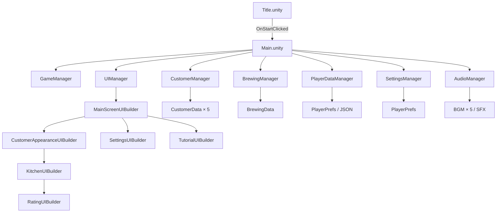

# PBL2 프로젝트 현황 보고서

> **분석 일시**: 2026-07-21  
> **엔진**: Unity (C#)  
> **장르**: 차 카페 경영 시뮬레이션

---

## 1. 프로젝트 개요

**게임명**: Tea Culture Café (가칭)  
**장르**: 차 문화 카페 경영 + 손님 응대 시뮬레이션  
**목표**: 플레이어가 차를 제조하여 다국적 손님에게 제공하고 별점과 보상을 획득

### 핵심 컨셉
- 🍵 5가지 차 종류 (유자차, 말차, 보이차, 연꽃차, 차이)
- 👥 5명의 개성 있는 동물 캐릭터 손님
- 🌏 5개국 문화 사운드 테마 (한국, 중국, 일본, 베트남, 키르기스스탄)
- ⭐ 별점 기반 평가 시스템

---

## 2. 전체 폴더 구조

```
Assets/
├── Scenes/
│   ├── Title.unity          ✅ 완성
│   └── Main.unity           ⚠️ 기본 씬만 존재
│
├── Scripts/
│   ├── Core/                ✅ 완성
│   │   ├── GameManager.cs
│   │   ├── GameConstants.cs
│   │   ├── MainSceneInitializer.cs
│   │   └── Singleton.cs
│   ├── Game/                ✅ 완성
│   │   ├── BrewingManager.cs
│   │   ├── Customer.cs
│   │   ├── CustomerManager.cs
│   │   └── MainScreenManager.cs
│   ├── UI/                  ⚠️ 일부 미완성
│   │   ├── TitleScreenManager.cs    ✅
│   │   ├── TitleScreenUIBuilder.cs  ❌ 빈 파일
│   │   ├── MainScreenUIBuilder.cs   ✅
│   │   ├── KitchenUIBuilder.cs      ✅
│   │   ├── CustomerAppearanceUIBuilder.cs ✅
│   │   ├── RatingUIBuilder.cs       ✅
│   │   ├── SettingsUIBuilder.cs     ✅
│   │   ├── TutorialUIBuilder.cs     ✅
│   │   ├── UIManager.cs             ✅
│   │   ├── PlayerHUD.cs             ✅
│   │   └── FontHelper.cs            ✅
│   ├── Data/                ✅ 완성
│   │   ├── CustomerData.cs
│   │   ├── CustomerDataHelper.cs
│   │   └── PlayerDataManager.cs
│   ├── Audio/               ✅ 완성
│   │   ├── AudioManager.cs
│   │   └── SettingsManager.cs
│   └── Systems/             ❌ 빈 폴더
│
├── Resources/
│   ├── ScriptableObjects/
│   │   └── Customers/       ✅ 5명 완성
│   │       ├── Customer_Denu.asset
│   │       ├── Customer_Hyuntae.asset
│   │       ├── Customer_Luna.asset
│   │       ├── Customer_Sakura.asset
│   │       └── Customer_Wei.asset
│   └── Audio/
│       ├── Music/           ✅ 5개국 트랙 완성
│       └── SFX/             ❓ 내용 미확인
│
└── Sprites/
    └── Character/
        └── Customers/       ✅ 초상화 5개 완성
```

---

## 3. 씬 구조

| 씬 | 파일 크기 | 상태 | 설명 |
|---|---|---|---|
| `Title.unity` | 45,821 bytes | ✅ 풍부한 구성 | 타이틀 화면, 버튼 UI 포함 |
| `Main.unity` | 9,013 bytes | ⚠️ 미니멀 | GameManager 오브젝트만 존재로 추정 |

> [!IMPORTANT]
> `GameConstants.cs`에 `SCENE_TUTORIAL`, `SCENE_KITCHEN`이 정의되어 있으나 실제 씬 파일이 없음. 이 씬들은 현재 **런타임 UI 빌더로 대체** 중.

---

## 4. 아키텍처 분석

### 4.1 핵심 패턴: Singleton 기반 매니저

모든 매니저 클래스가 `Singleton<T>`를 상속하는 **중앙 집중식** 구조.

```
GameManager (Singleton)
├── AudioManager (Singleton)
│   └── SettingsManager (Singleton)
├── CustomerManager (Singleton)
├── BrewingManager (Singleton)
├── PlayerDataManager (Singleton)
└── UIManager (Singleton)
```

#### Singleton 특징
- `DontDestroyOnLoad` 처리로 씬 전환 시 유지
- 씬 전환 후에도 매니저 상태 보존

### 4.2 UI 아키텍처: Code-First Builder 패턴

> [!NOTE]
> UI를 **Unity 프리팹 없이 순수 코드로 동적 생성**하는 독특한 방식.  
> 장점: 버전 충돌 없음, 씬 복잡도 낮음  
> 단점: 디자인 변경 시 코드 수정 필요, 인코딩 문제 발생(한글 깨짐)

| Builder | 방식 | 상태 |
|---|---|---|
| `MainScreenUIBuilder` | `MonoBehaviour` | ✅ |
| `KitchenUIBuilder` | 일반 클래스 | ✅ |
| `CustomerAppearanceUIBuilder` | 일반 클래스 | ✅ |
| `RatingUIBuilder` | 일반 클래스 | ✅ |
| `SettingsUIBuilder` | `MonoBehaviour` | ✅ |
| `TutorialUIBuilder` | `MonoBehaviour` | ✅ |
| `TitleScreenUIBuilder` | `MonoBehaviour` | ❌ **빈 파일** |

### 4.3 게임 흐름 (State Machine)

```
GameState.Loading
    ↓ Awake()
GameState.Title   →  씬: Title.unity
    ↓ OnStartClicked()
GameState.Playing  →  씬: Main.unity
    ↓ (게임 중)
GameState.Paused
    ↓ ResumeGame()
GameState.Playing
    ↓ (게임 종료 조건)
GameState.GameOver
```

### 4.4 게임 플레이 루프

```
MainScreen
    ↓ [대기 버튼 클릭]
CustomerAppearance  ← 손님 등장 + 선호도 표시
    ↓ [주방으로 가기]
KitchenUI  ← 차 종류 / 온도 / 우림시간 선택
    ↓ [완료 버튼] → 5초 브루잉 타이머
RatingUI  ← 별점 + 보상 (돈, 경험치)
    ↓ [다음 버튼]
MainScreen  ← 손님 제거, 브루잉 리셋
```

---

## 5. 구현된 기능 상세

### ✅ 5.1 손님 시스템

**파일**: [CustomerData.cs](file:///c:/Users/vipgo/Dev/PBL2/Assets/Scripts/Data/CustomerData.cs), [Customer.cs](file:///c:/Users/vipgo/Dev/PBL2/Assets/Scripts/Game/Customer.cs), [CustomerManager.cs](file:///c:/Users/vipgo/Dev/PBL2/Assets/Scripts/Game/CustomerManager.cs)

| 항목 | 내용 |
|---|---|
| 손님 수 | 5명 (Luna, Hyuntae, Wei, Sakura, Denu) |
| 데이터 소스 | ScriptableObject (Inspector 연결) → Resources 폴더 → 하드코딩 폴백 **3단계 폴백** |
| 스프라이트 | 5개 PNG 초상화 준비 완료 |
| 친밀도 | `familiarityLevel` (0~5단계) 시스템 존재하나 **레벨업 후 영속화 없음** |
| 대기 큐 | `Queue<Customer>` 구조 |

**5명의 손님 캐릭터 정보:**

| 이름 | 캐릭터 | 선호 차 | 온도 | 우림 | 성격 |
|---|---|---|---|---|---|
| Luna | 토끼 | 유자차 | 낮음 | 짧음 | 수줍음, 예민함 |
| Hyuntae | 사자 | 차이 | 높음 | 길음 | 활발함, 자신감 |
| Wei | 판다 | 보이차 | 중간 | 길음 | 차분함, 건강 관심 |
| Sakura | 여우 | 말차 | 중간 | 짧음 | 활기찬, 사교적 |
| Denu | 독수리 | 차이 | 높음 | 길음 | 침착함, 지혜로움 |

### ✅ 5.2 차 제조 시스템 (Brewing)

**파일**: [BrewingManager.cs](file:///c:/Users/vipgo/Dev/PBL2/Assets/Scripts/Game/BrewingManager.cs)

| 항목 | 내용 |
|---|---|
| 차 종류 | 5종 (yuzu, matcha, puerh, lotus, chai) |
| 온도 | 3단계 (낮음/중간/높음) |
| 우림 시간 | 3단계 (짧음/중간/길음) |
| 제조 시간 | 5초 타이머 |
| 별점 산출 | 손님 선호도와 플레이어 선택 비교 (매칭 수에 따라 1~5점) |

**별점 산출 로직:**
```
3가지 모두 일치 → ★★★★★ (5점)
2가지 일치       → ★★★~★★★★ (랜덤 3~4점)
1가지 일치       → ★★~★★★ (랜덤 2~3점)
0가지 일치       → ★~★★ (랜덤 1~2점)
```

### ✅ 5.3 오디오 시스템

**파일**: [AudioManager.cs](file:///c:/Users/vipgo/Dev/PBL2/Assets/Scripts/Audio/AudioManager.cs), [SettingsManager.cs](file:///c:/Users/vipgo/Dev/PBL2/Assets/Scripts/Audio/SettingsManager.cs)

| 항목 | 내용 |
|---|---|
| BGM 트랙 | 5개 국가별 `.wav` 파일 (각 ~21MB) |
| 테마 | 한국/중국/일본/베트남/키르기스스탄/랜덤 |
| 볼륨 저장 | `PlayerPrefs` 영속 저장 |
| 씬 감지 | 씬 로드 시 자동으로 해당 테마 음악 재생 |
| SFX 시스템 | 테마별 SFX 매핑 구조 (파일 미확인) |

### ✅ 5.4 플레이어 데이터

**파일**: [PlayerDataManager.cs](file:///c:/Users/vipgo/Dev/PBL2/Assets/Scripts/Data/PlayerDataManager.cs)

| 항목 | 초기값 | 저장 방식 |
|---|---|---|
| 이름 | "게스트" | PlayerPrefs + JSON |
| 레벨 | 1 | |
| 돈 | 10,000원 | |
| 경험치 | 0 | |

**레벨업 공식**: `필요 경험치 = 500 + (현재레벨 - 1) × 200`

### ✅ 5.5 경제 시스템 (상수 정의)

**파일**: [GameConstants.cs](file:///c:/Users/vipgo/Dev/PBL2/Assets/Scripts/Core/GameConstants.cs)

| 차 종류 | 판매가 | 재료비 | 해금 레벨 |
|---|---|---|---|
| 유자차 | 4,000원 | 1,500원 | 기본 |
| 말차 | 5,000원 | 2,000원 | 기본 |
| 보이차 | 7,000원 | 2,500원 | Lv.5 |
| 연꽃차 | 5,500원 | 1,800원 | Lv.5 |
| 차이 | 6,000원 | 2,200원 | Lv.10 |

### ✅ 5.6 설정 UI

**파일**: [SettingsUIBuilder.cs](file:///c:/Users/vipgo/Dev/PBL2/Assets/Scripts/UI/SettingsUIBuilder.cs)

- 배경음량 슬라이더 (0~100%)
- 효과음량 슬라이더 (0~100%)
- 사운드 테마 선택 (〈 〉 화살표 버튼)
- 설정 PlayerPrefs 영속 저장

---

## 6. 미구현 / 문제 항목

### ❌ 6.1 TitleScreenUIBuilder.cs — 완전 빈 파일

**파일**: [TitleScreenUIBuilder.cs](file:///c:/Users/vipgo/Dev/PBL2/Assets/Scripts/UI/TitleScreenUIBuilder.cs)

파일이 존재하지만 내용이 **0바이트**. Title 씬은 Unity Editor에서 직접 만든 것으로 추정.  
`TitleScreenManager.cs`가 이미 Title 씬을 관리하므로 당장 치명적이지는 않음.

### ⚠️ 6.2 KitchenUIBuilder 인코딩 손상

**파일**: [KitchenUIBuilder.cs](file:///c:/Users/vipgo/Dev/PBL2/Assets/Scripts/UI/KitchenUIBuilder.cs)

파일 내 한글 주석이 **깨진 상태** (UTF-8 인코딩 문제 추정).  
기능 자체는 작동하나 코드 가독성이 매우 나쁨.

> [!WARNING]
> `CustomerAppearanceUIBuilder.cs`도 동일한 인코딩 손상 발생.  
> "嫄곗젅", "?먮떂 嫄곗젅" 등 한글이 깨진 채로 저장되어 있음.

### ❌ 6.3 Systems 폴더 — 완전 빈 폴더

`Assets/Scripts/Systems/` 폴더가 존재하나 파일 없음.  
컬렉션 시스템, 상점 시스템, 해금 시스템 등이 들어갈 예정이었던 것으로 추정.

### ⚠️ 6.4 미구현 기능 (TODO 코드 발견)

**MainScreenManager.cs**에서 발견된 미완성 함수:

```csharp
private void OnShopClicked()
{
    Debug.Log("상점 클릭");
    // TODO: 상점 화면 이동 (Step ?)   ← 미구현
}

private void OnCollectionClicked()
{
    Debug.Log("컬렉션 클릭");
    // TODO: 컬렉션 화면 이동 (Step ?) ← 미구현
}
```

**RatingUIBuilder.cs**에서 발견된 미완성 부분:

```csharp
int baseReward = 1000; // TODO: GameConstants에서 가져오기   ← 상수 활용 안 됨
```

### ⚠️ 6.5 친밀도 시스템 미완성

`Customer.cs`에 `familiarityLevel` (0~5) 시스템이 구현되어 있으나:
- 매 방문 시 `IncreaseFamiliarity()`가 호출되어 +1 증가
- 하지만 **데이터가 영속 저장되지 않음** (게임 종료 시 초기화)
- `CustomerData.cs`에도 친밀도 필드 없음

### ⚠️ 6.6 튜토리얼 시스템 미완성

**TutorialManager.cs**가 존재하고 **TutorialUIBuilder.cs**가 UI를 만들지만:
- 튜토리얼 텍스트가 하드코딩된 `"튜토리얼 텍스트"` 플레이스홀더
- 실제 튜토리얼 단계별 내용 없음
- Reflection으로 private 필드를 강제로 주입하는 불안정한 구조

### ⚠️ 6.7 해금 시스템 미연결

`GameConstants.cs`에 해금 레벨이 정의되어 있으나:

```csharp
public const int LEVEL_TEA_UNLOCK_PUERH = 5;   // 보이차
public const int LEVEL_TEA_UNLOCK_LOTUS = 5;   // 연꽃차
public const int LEVEL_TEA_UNLOCK_CHAI = 10;   // 차이
```

→ KitchenUIBuilder에서 **레벨 체크 없이** 항상 5가지 차 모두 표시.

### ⚠️ 6.8 차 가격 시스템 미연결

`GameConstants.cs`에 차 가격/재료비가 정의되어 있으나:
- `RatingUIBuilder.cs`의 보상이 `1000 + (별점 × 500)` 하드코딩
- 실제 차 가격 기반 수익 계산 없음

---

## 7. 버그 및 위험 요소

### 🐛 7.1 PlayerHUD — 빈 구현 가능성

**파일**: [PlayerHUD.cs](file:///c:/Users/vipgo/Dev/PBL2/Assets/Scripts/UI/PlayerHUD.cs) (1,323 bytes)  
파일 크기가 작음. `Initialize()` 및 `RefreshUI()`만 정의되어 있을 가능성이 있음.

### 🐛 7.2 TutorialUIBuilder — Reflection 취약성

```csharp
tutorialManager.GetType().GetField("_tutorialPanel", 
    System.Reflection.BindingFlags.NonPublic | ...)
    .SetValue(tutorialManager, tutorialObj);
```

IL2CPP 빌드(iOS/Android)에서 Reflection이 Strip될 경우 **런타임 크래시** 발생 가능.

### 🐛 7.3 메인 씬 Canvas 참조 문제

`MainScreenManager.OnWaitCustomerClicked()`에서:
```csharp
Canvas canvas = UnityEngine.Object.FindObjectOfType<Canvas>();
```
씬에 Canvas가 여러 개이면 **잘못된 Canvas 참조** 가능.

### 🐛 7.4 SFX 파일 없을 경우 LogWarning 폭발

`AudioManager.LoadAudioClip()`이 파일 없을 시 `Debug.LogWarning` 발생.  
SFX 폴더 내 실제 파일이 없으면 게임 플레이 중 콘솔에 Warning 대량 발생.

---

## 8. 에셋 현황

### 8.1 스프라이트

| 카테고리 | 상태 |
|---|---|
| 캐릭터 초상화 (5개) | ✅ 완성 (`customer_*_portrait.png`) |
| 캐릭터 풀바디 (8장 기타) | ✅ 존재 (`customer_xxxxxx.png`) |
| Background, Decoration, Effects | ✅ 폴더 존재 (내용 미확인) |
| Furniture, Tea, UI | ✅ 폴더 존재 (내용 미확인) |

### 8.2 오디오

| 카테고리 | 상태 |
|---|---|
| BGM 5곡 (각 20MB) | ✅ 완성 |
| SFX | ❓ 폴더 존재, 파일 미확인 |

---

## 9. 전체 구현 완성도 요약

| 시스템 | 완성도 | 메모 |
|---|---|---|
| 게임 상태 관리 | 🟢 90% | GameOver 처리 미완 |
| 타이틀 씬 | 🟢 90% | UIBuilder 빈 파일 |
| 메인 화면 | 🟡 70% | 상점/컬렉션 미구현 |
| 손님 시스템 | 🟢 85% | 친밀도 영속화 없음 |
| 차 제조 시스템 | 🟢 90% | 해금 시스템 미연결 |
| 별점/보상 시스템 | 🟡 75% | 가격 상수 미연결 |
| 오디오 시스템 | 🟢 90% | SFX 파일 미확인 |
| 설정 시스템 | 🟢 95% | 거의 완성 |
| 튜토리얼 | 🔴 30% | 텍스트 미작성, 구조 불안정 |
| 상점 | 🔴 0% | 미구현 |
| 컬렉션 | 🔴 0% | 미구현 |
| 해금 시스템 | 🔴 0% | 상수만 정의됨 |
| 저장/로드 | 🟡 60% | 친밀도 미영속 |

**전체 완성도 추정: 약 65~70%**

---

## 10. 다음 작업 우선순위 제안

### 🔥 긴급 (버그/크래시 위험)

1. **TutorialUIBuilder Reflection 구조 개선** → `[SerializeField]` public 필드로 변경
2. **KitchenUIBuilder / CustomerAppearanceUIBuilder 인코딩 복구** → UTF-8 재저장

### 🚀 핵심 기능 완성

3. **튜토리얼 텍스트 작성** → 실제 게임 플레이 안내 단계 구성
4. **해금 시스템 연결** → 레벨에 따라 차 잠금/해제 처리
5. **친밀도 영속 저장** → `PlayerDataManager`에 손님별 친밀도 추가

### 📦 미구현 시스템

6. **상점 화면** → 카페 업그레이드, 차 구매 등
7. **컬렉션 화면** → 손님 도감, 해금된 차 목록
8. **GameOver 처리** → 조건 및 결과 화면

### 🎨 품질 개선

9. **RatingUIBuilder 보상 공식** → `GameConstants` 가격 기반으로 리팩터
10. **PlayerHUD 실시간 업데이트** → 돈/레벨 변동 시 즉시 반영 확인
11. **TitleScreenUIBuilder 구현** → 코드 기반 타이틀 UI 빌더 완성

---

## 11. 아키텍처 다이어그램



---

*보고서 생성: Antigravity AI — 코드 분석 기반 자동 생성*
